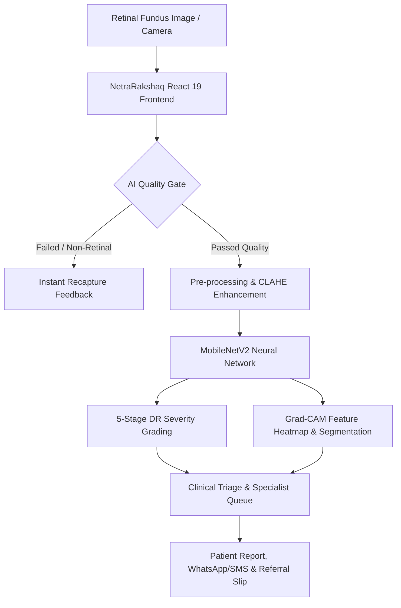

# 👁️ NetraRakshaq (नेत्ररक्षक)
### *Explainable AI Platform for Diabetic Retinopathy Screening & Clinical Triage in Underserved Communities*

[](https://react.dev/)
[](https://www.typescriptlang.org/)
[](https://vitejs.dev/)
[](https://tailwindcss.com/)
[](https://fastapi.tiangolo.com/)
[](https://pytorch.org/)


---

## 📌 Problem Statement
Diabetic Retinopathy (DR) is the leading cause of preventable blindness among working-age adults globally. In rural and peri-urban India:
- Over **77 million people** live with diabetes, yet fewer than **10%** receive annual retinal examinations.
- India has fewer than **25,000 ophthalmologists** for 1.4 billion people — with over 70% concentrated in tier-1 urban centers.
- Rural screening camps face significant challenges: **unreliable internet connectivity**, **poor fundus image capture (blur/glare)**, and **lack of immediate specialist referral pathways**.

**NetraRakshaq** addresses this crisis through a **multi-stage, explainable AI screening pipeline** designed for field tablets, rural health workers (ASHAs/ANMs), and tele-ophthalmology networks.

---

## 🌟 Key Features

### 1. 🛡️ AI Image Quality Gate (Pre-Inference)
- Automatically assesses fundus authenticity, illumination uniformity, aperture borders, and focus blur before processing.
- Rejects non-retinal uploads, heavy glare, and out-of-focus captures with instant real-time guidance (e.g., *"Recapture: Adjust illumination & steady device"*), preventing diagnostic hallucinations.

### 2. 🧠 Multi-Stage Deep Learning Pipeline
- **Contrast Enhancement**: CLAHE (Contrast Limited Adaptive Histogram Equalization) and bilateral filtering for low-illumination field fundus imagery.
- **Vascular & Anatomical Localization**: Retinal blood vessel segmentation, optic disc segmentation, and macula center detection.
- **5-Stage ICDR Classification**:
  - `Grade 0`: No Diabetic Retinopathy (Annual follow-up)
  - `Grade 1`: Mild NPDR (Microaneurysms only)
  - `Grade 2`: Moderate NPDR (Hard exudates, blot hemorrhages)
  - `Grade 3`: Severe NPDR (4-2-1 Rule: >20 hemorrhages in 4 quadrants, venous beading)
  - `Grade 4`: Proliferative DR (Neovascularization, high risk of vision loss)

### 3. 🔍 Clinical Explainability & Visual Evidence
- **Grad-CAM Attention Heatmaps**: Highlights exact retinal regions driving the AI classification score.
- **Why Flagged Summary**: Granular clinical breakdown (e.g., *"Marked venous beading along superior temporal arcade"*).
- **Rule Verification**: Displays ICDR and 4-2-1 international grading protocol metrics.

### 4. 🌐 Multilingual Accessibility (10 Indian Languages)
Built for grassroots community adoption with instant toggle across:
- **English**, **हिन्दी (Hindi)**, **मराठी (Marathi)**, **বাংলা (Bengali)**, **ਪੰਜਾਬੀ (Punjabi)**, **தமிழ் (Tamil)**, **తెలుగు (Telugu)**, **छत्तीसगढ़ी (Chhattisgarhi)**, **ગુજરાતી (Gujarati)**, and **ಕನ್ನಡ (Kannada)**.

### 5. 🏥 Role-Based Clinical Workflow
- **Field Health Worker**: Simplified registration, camera/image upload, instant triage verdict, and offline queueing.
- **Ophthalmologist / Specialist**: High-throughput tele-triage dashboard, interactive image zoom/pan, confirm/modify diagnoses, and sign digital referral slips.
- **District Administrator**: Epidemiological heatmaps, PHC screening capacity forecasting, and follow-up SMS compliance monitoring.

### 6. 📶 Offline-First & Rural Resilience
- Built-in local caching and simulation engine allowing complete uninterrupted operation even in zero-connectivity environments.

---

## 🏗️ System Architecture



---

## 📁 Repository Structure

```
NetraRakshaq/
├── backend/
│   ├── app.py                      # FastAPI inference engine & quality gate
│   └── model/
│       ├── DR_MobileNetV2_Final.keras # MobileNetV2 architecture & weights
│       └── model.keras             # Packaged model artifact
├── public/
│   ├── _redirects                  # SPA client-side routing fallback
│   └── clinical-fundus-bg.jpg      # High-resolution clinical backdrop
├── src/
│   ├── assets/                     # Icons and static brand assets
│   ├── components/
│   │   ├── layout/                 # Header, Sidebar, MobileNav, App Shell
│   │   └── ui/                     # QualityGate, FundusViewer, ClinicalEvidence, KPICards
│   ├── context/
│   │   └── AppStateContext.tsx     # Global patient queue, role & network state
│   ├── lib/
│   │   ├── types.ts                # Strict TypeScript clinical interfaces
│   │   └── demoData.ts             # Validated clinical preset scenarios
│   ├── pages/
│   │   ├── Login.tsx               # Multilingual entry & role switch portal
│   │   ├── Overview.tsx            # Community screening overview & metrics
│   │   ├── NewScreening.tsx        # Live retinal upload & AI grading page
│   │   ├── DoctorDashboard.tsx     # Specialist triage queue & referral manager
│   │   ├── DoctorReview.tsx        # In-depth clinical review & sign-off
│   │   ├── Explainability.tsx      # Grad-CAM heatmap & vessel analysis
│   │   ├── PatientResults.tsx      # Bilingual patient report & prescription
│   │   ├── PatientPortal.tsx       # Self-service patient report download
│   │   ├── ScreeningQueue.tsx      # Camp queue & offline sync manager
│   │   ├── Simulation.tsx          # District workload simulation & capacity
│   │   └── Settings.tsx            # System config, ML connectivity & AI threshold
│   ├── services/
│   │   ├── mlApi.ts                # Production backend API client
│   │   └── demoApi.ts              # Local simulation & fallback adapter
│   ├── App.tsx                     # Route configuration & role guards
│   ├── index.css                   # Tailwind CSS styling & design tokens
│   └── main.tsx                    # Application entry point
├── vercel.json                     # Vercel deployment configuration
├── wrangler.jsonc                  # Cloudflare Pages deployment manifest
├── package.json                    # Frontend dependencies & scripts
├── vite.config.ts                  # Vite build & proxy configuration
└── README.md                       # Documentation & presentation guide
```

---

## ⚡ Quick Start / Local Setup

### Prerequisites
- **Node.js**: v18.0 or newer
- **Python**: v3.10 to v3.14
- **Package Manager**: `npm` or `pnpm`

### 1. Clone the Repository
```bash
git clone https://github.com/codexadiitya/NetraRakshaq.git
cd NetraRakshaq
```

### 2. Frontend Setup (React + Vite)
```bash
# Install frontend dependencies
npm install

# Start the Vite development server
npm run dev
```
The frontend will start at **`http://localhost:8443`** (or `http://localhost:5173`).

### 3. ML Inference Backend (FastAPI + PyTorch)
```bash
# Install Python dependencies
pip install fastapi uvicorn opencv-python pillow numpy torch keras

# Start the inference server
uvicorn backend.app:app --host 127.0.0.1 --port 8000
```
The ML API will be live at **`http://127.0.0.1:8000`** and automatically proxied through the frontend.

---

## 🚀 Live Static Deployment (No Backend Required)

NetraRakshaq includes a full offline simulation engine. You can deploy it to any static web host in under 1 minute:

### Option A: Vercel
```bash
npm run build
npx -y vercel --prod
```

### Option B: Cloudflare Pages
```bash
npm run build
npx -y wrangler pages deploy dist --project-name=netrarakshaq
```

### Option C: Netlify Drag & Drop
1. Run `npm run build`
2. Drag and drop the `dist/` directory onto [Netlify Drop](https://app.netlify.com/drop).

---

## 🎯 Clinical Grading Reference

| Grade | Clinical Condition | Findings | Follow-up / Triage |
| :---: | :--- | :--- | :--- |
| **0** | **No DR** | No abnormalities | Routine annual screening |
| **1** | **Mild NPDR** | Microaneurysms only | Follow-up in 9–12 months |
| **2** | **Moderate NPDR** | Hard exudates, cotton wool spots, hemorrhages | Follow-up in 3–6 months |
| **3** | **Severe NPDR** | 4-2-1 Rule: >20 hemorrhages in 4 quadrants, venous beading | **Urgent referral (2–4 weeks)** |
| **4** | **Proliferative DR** | Neovascularization, vitreous/preretinal hemorrhage | **Immediate referral (1–2 weeks)** |

---

## 👥 Contributors & Acknowledgements
- **Team NetraRakshaq** — Developed for the **Smart India Hackathon (SIH)**.
- Dedicated to improving access to early vision care in rural healthcare centers (PHCs/CHCs) across India.

---

## 📄 License
This project is licensed under the MIT License - see the [LICENSE](LICENSE) file for details.
